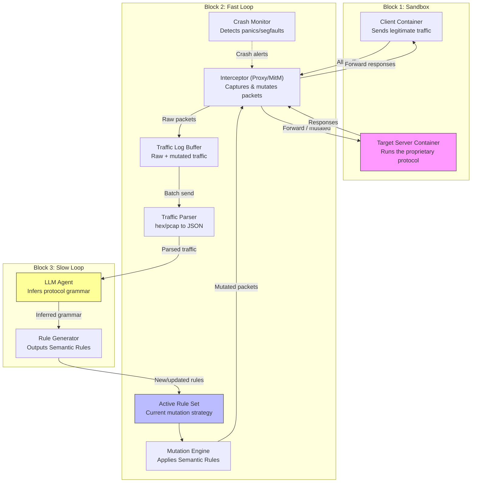

# LIFA-Fuzz

> **Live-traffic Inference & Asynchronous Fuzzing Framework** — A black-box fuzzer for custom/proprietary network protocols that infers protocol semantics from live traffic using an LLM, without requiring RFCs or source code.

---

## Core Philosophy

LIFA-Fuzz is built on a **Fast-Slow Loop Asynchronous Architecture** that decouples high-speed fuzzing from deep protocol analysis, with a **pluggable sandbox backend** for maximum isolation:

| Loop | Speed | Role |
|------|-------|------|
| **Fast Loop** (Block 2) | 10,000+ EPS | Network interception, packet mutation, crash detection |
| **Slow Loop** (Block 3) | ~1 inference/min | Traffic parsing, LLM-powered grammar inference, rule generation |

| Sandbox Backend | `reset_state()` | Isolation | Phase |
|----------------|-----------------|-----------|-------|
| Docker (prototype) | ~200-500ms | Process-level (shared kernel) | Phase 1 |
| Firecracker MicroVM (production) | < 10ms | Kernel-level (isolated guest kernel) | Phase 4 |

| Loop | Speed | Role |
|------|-------|------|
| **Fast Loop** (Block 2) | 10,000+ EPS | Network interception, packet mutation, crash detection |
| **Slow Loop** (Block 3) | ~1 inference/min | Traffic parsing, LLM-powered grammar inference, rule generation |

The Fast Loop runs continuously at maximum speed, using the *current* rule set. Meanwhile, the Slow Loop asynchronously consumes traffic logs, infers protocol structure, and pushes updated **Semantic Rules** back to the Fast Loop — enabling intelligent, evolving fuzz campaigns.

---

## Architecture



---

## Directory Structure

```
LIFA-Fuzz/
├── sandbox/                # Block 1: Sandbox backends
│   ├── client/             #   Client container (Dockerfile, scripts)
│   ├── server/             #   Target server container (Dockerfile, dummy server)
│   ├── docker_driver.py     #   DockerSandbox(BaseSandbox) — Phase 1 backend
│   └── docker-compose.yml  #   Orchestrates client + server + interceptor
├── fast_loop/              # Block 2: High-speed interception & mutation
│   ├── interceptor.py      #   Network proxy / MitM (asyncio)
│   ├── mutator.py          #   Mutation engine (bit-flip, rule-based, structural)
│   └── crash_monitor.py    #   Crash detection via BaseSandbox abstraction
├── slow_loop/              # Block 3: LLM-powered protocol analysis
│   ├── llm_agent.py        #   LLM API interaction (litellm)
│   ├── parser.py           #   Raw traffic to JSON converter
│   └── rule_generator.py   #   Converts LLM output to SemanticRule objects
├── shared/                 # Shared utilities & data models
│   ├── sandbox_abstraction.py  # BaseSandbox abstract interface + driver registry
│   ├── schemas.py          #   Pydantic models (SemanticRule, TrafficRecord, etc.)
│   └── logger.py           #   Structured async logging setup
├── tests/                  # Pytest test suite
│   ├── conftest.py         #   Shared fixtures
│   ├── test_schemas.py
│   ├── test_interceptor.py
│   ├── test_mutator.py
│   ├── test_parser.py
│   └── test_llm_agent.py
├── docs/                   # Project documentation
│   ├── architecture.md     #   Detailed architecture & data contracts
│   └── development_plan.md #   Phase-by-phase implementation roadmap
├── config.yaml             # Global configuration (ports, LLM settings, sandbox driver)
├── requirements.txt        # Python dependencies
└── README.md               # This file
```

---

## Setup & Quick Start

### Prerequisites

- Python 3.11+
- Docker & Docker Compose (for sandbox)
- An LLM API key (OpenAI, Anthropic, or any litellm-supported provider)

### Installation

```bash
# Clone the repo
git clone https://github.com/<your-org>/LIFA-Fuzz.git
cd LIFA-Fuzz

# Create virtual environment
python -m venv .venv
source .venv/bin/activate

# Install dependencies
pip install -r requirements.txt
```

### Quick Start (Sandbox Mode)

```bash
# 1. Start the sandbox — client + dummy target server
docker compose -f sandbox/docker-compose.yml up --build

# 2. In a separate terminal, launch the Fast Loop interceptor
python -m fast_loop.interceptor --config config.yaml

# 3. In another terminal, launch the Slow Loop LLM agent
python -m slow_loop.llm_agent --config config.yaml
```

### Configuration

Edit `config.yaml` to set:

- **Sandbox ports** (client → proxy → server)
- **LLM provider & model** (via litellm)
- **Mutation strategy** (bit-flip, rule-based, structural)
- **Traffic log rotation & buffer size**
- **Crash detection thresholds**

---

## How It Works (End-to-End Flow)

1. **Block 1** — The Client sends normal protocol traffic toward the Target Server.
2. **Block 2 — Interceptor** sits between them as a transparent proxy, capturing every packet into a traffic log buffer.
3. **Block 2 — Mutation Engine** reads the active rule set and creates mutated variants of captured packets, forwarding them to the Target Server.
4. **Block 2 — Crash Monitor** watches the Target Server process. Any crash (SIGSEGV, SIGABRT, unhandled exception) is logged with the offending packet.
5. **Block 3 — Parser** periodically reads the traffic log, converting raw bytes/hex into structured JSON.
6. **Block 3 — LLM Agent** sends the parsed traffic to an LLM, asking it to infer fields, magic bytes, length encodings, and state machines.
7. **Block 3 — Rule Generator** converts the LLM's inference into `SemanticRule` objects and pushes them to the Fast Loop's active rule set.
8. **The cycle repeats** — each iteration the Fast Loop gets smarter about where and how to mutate.

---

## Research Context

LIFA-Fuzz is a research project exploring whether LLMs can effectively replace human protocol reverse-engineering in fuzzing campaigns. Key research questions:

- Can an LLM infer enough protocol structure from traffic alone to enable *effective* structural fuzzing?
- What is the optimal cadence for rule updates (how often should the Slow Loop push)?
- How do different LLMs compare in protocol inference accuracy?

---

## License

MIT — Research & Educational Use.
