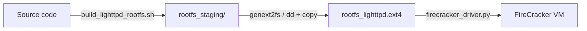

# FireCracker Auto-Setup Module

> **Mục tiêu**: Tự động hóa việc xây dựng rootfs và cấu hình FireCracker VM cho bất kỳ target binary nào, giảm thiểu thao tác thủ công từ 30 phút xuống còn 1 câu lệnh.

---

## 1. Vấn đề hiện tại (Problem Statement)

Để thêm một target mới vào FireCracker, researcher phải làm thủ công:

| Bước | Mô tả | Thời gian | Tần suất |
|---|---|---|---|
| 1. Build kernel | `build_kernel.sh` (toolchain, menuconfig, make) | ~30 phút | 1 lần |
| 2. Build rootfs | `build_lighttpd_rootfs.sh` (cross-compile, copy thủ công) | ~5-15 phút | Mỗi target mới |
| 3. dd + mkfs.ext4 | Tạo ext4 image, copy filesystem vào | ~2 phút | Mỗi target mới |
| 4. TAP network | `ip tuntap add`, `ip addr add`, `ip link set up` | ~30 giây | Cần sudo mỗi lần run |
| 5. Cấu hình VM | FireCracker API: vcpu, mem, kernel, rootfs, network | ~10 giây | Tự động (driver có sẵn) |

**Tổng thời gian thủ công cho mỗi target mới: ~10-50 phút** — không khả thi cho research cần thử nghiệm nhanh nhiều targets.

**Nguyên nhân gốc**: Không có pipeline tự động build rootfs từ source. Hiện tại:



Mỗi bước là shell script thủ công, không tái sử dụng, không tham số hóa.

---

## 2. Giải pháp: Docker → Ext4 → FireCracker

### 2.1 Kiến trúc tổng thể

```mermaid
graph TD
    subgraph "Input (Researcher)"
        SRC[Source code / Dockerfile]
        DEPS[Package dependencies: apt, pip, etc.]
        GCOV[gcov/llvm flags (tùy chọn)]
    end

    subgraph "Module: build_rootfs()"
        DB[Docker build]
        CE[Docker create + export]
        EX[Extract tar → staging dir]
        MK[genext2fs → rootfs.ext4]
    end

    subgraph "FireCracker Runtime"
        FCVM[FireCracker VM]
        FCAPI[FireCracker API]
    end

    SRC --> DB
    DEPS --> DB
    GCOV --> DB
    DB --> CE
    CE --> EX
    EX --> MK
    MK --> FCVM
    FCVM --> FCAPI

    style Module fill:#4a9eff33,stroke:#4a9eff
```

### 2.2 Luồng chi tiết

```
Phase 1: Docker Build
  Input:  Dockerfile (hoặc auto-generate từ template)
  ──────
  1. docker build --target fuzz-root -t lifa-rootfs-{target}:latest .
  2. docker create --name lifa-rootfs-{target}-tmp lifa-rootfs-{target}:latest
  3. docker export lifa-rootfs-{target}-tmp > /tmp/rootfs-{target}.tar
  4. docker rm lifa-rootfs-{target}-tmp

Phase 2: Ext4 Image Creation
  Input:  /tmp/rootfs-{target}.tar
  ──────
  1. mkdir -p /tmp/rootfs-{target}-staging
  2. tar -xf /tmp/rootfs-{target}.tar -C /tmp/rootfs-{target}-staging
  3. genext2fs -b $SIZE -d /tmp/rootfs-{target}-staging \
       sandbox/firecracker_env/rootfs_{target}.ext4
     (hoặc fallback: dd + mkfs.ext4 + copy)
  4. rm -rf /tmp/rootfs-{target}.tar /tmp/rootfs-{target}-staging

Phase 3: FireCacker Launch
  Input:  rootfs_{target}.ext4 + target binary path
  ──────
  1. TAP: create / reuse TAP device
  2. VMM: firecracker --api-sock /tmp/firecracker-{target}.sock
  3. API PUT: /boot-source → vmlinux
  4. API PUT: /drives → rootfs_{target}.ext4
  5. API PUT: /network-interfaces → tap0
  6. API PUT: /machine-config → vcpu=1, mem=512
  7. API PUT: /actions → InstanceStart
  8. Wait for SSH / serial ready
  9. return FirecrackerSandbox instance
```

---

## 3. API Design

### 3.1 Class: `FirecrackerSandbox` (mở rộng)

```python
class FirecrackerSandbox:
    def __init__(self, target_name: str, config: FirecrackerTargetConfig):
        self.target_name = target_name
        self.config = config

    async def setup(self) -> None:
        """Ensures rootfs image exists. Auto-builds if missing."""
        rootfs = self.config.rootfs_path
        if not Path(rootfs).exists():
            await self.build_rootfs(
                target_name=self.target_name,
                dockerfile=self.config.dockerfile or self._auto_dockerfile(),
                size_mb=self.config.rootfs_size_mb or 64,
            )

    async def build_rootfs(
        self,
        target_name: str,
        dockerfile: str | Path,
        size_mb: int = 64,
        temp_dir: str = "/tmp/lifa-build",
    ) -> Path:
        """
        Docker → ext4 pipeline.

        Steps:
            1. docker build -t lifa-rootfs-{target_name}:latest -f {dockerfile} .
            2. docker create → export → tar
            3. genext2fs -b {size_mb * 256} -d {staging}
            4. Output: sandbox/firecracker_env/rootfs_{target_name}.ext4
        """
        ...

    def _auto_dockerfile(self) -> str:
        """
        Tự sinh Dockerfile nếu researcher không cung cấp.

        Template mặc định:
            FROM ubuntu:22.04
            RUN apt-get update && apt-get install -y {self.config.packages}
            COPY {self.config.binary_path} /target/{self.config.binary_name}
            CMD ["/target/{self.config.binary_name}"]
        """
        ...

    def _configure_vm(
        self,
        kernel_path: str,
        rootfs_path: str,
        vcpu_count: int = 1,
        mem_size_mib: int = 512,
    ) -> dict:
        """Tạo các PUT request tới FireCracker API socket."""
        ...
```

### 3.2 `FirecrackerTargetConfig` (schema)

```python
@dataclass
class FirecrackerTargetConfig:
    """Cấu hình cho một target trên FireCracker.

    Researcher chỉ cần cung cấp tối thiểu:
        binary_path + name
    hoặc:
        dockerfile (để custom)
    """

    # === BẮT BUỘC ===
    target_name: str                     # "lighttpd", "bind9", v.v.

    # === TỐI THIỂU (chọn 1 trong 2) ===
    dockerfile: str | None = None        # Custom Dockerfile
    binary_path: str | None = None       # Pre-built binary local
    binary_name: str | None = None       # Tên file binary trong VM

    # === TÙY CHỌN ===
    packages: list[str] = field(default_factory=list)
    """Apt packages cần cài, ví dụ: libpcre3, openssl,..."""

    rootfs_size_mb: int = 64
    """Dung lượng rootfs (mặc định 64MB)."""

    kernel_path: str = "sandbox/firecracker_env/vmlinux"
    """Path tới kernel (dùng chung cho tất cả target)."""

    rootfs_output: str | None = None
    """Nơi lưu rootfs .ext4. Mặc định: sandbox/firecracker_env/rootfs_{name}.ext4"""

    vcpu_count: int = 1
    mem_size_mib: int = 512

    # === GCOV (tùy chọn, cho coverage-guided fuzzing) ===
    enable_gcov: bool = False
    gcov_flags: list[str] = field(default_factory=lambda: [
        "-fprofile-arcs", "-ftest-coverage",
    ])
```

### 3.3 Ví dụ sử dụng

```python
# Tối thiểu — chỉ cần binary
config = FirecrackerTargetConfig(
    target_name="bind9",
    binary_path="./bind-9.18/named",
    binary_name="named",
    packages=["libssl-dev", "libcap-dev"],
    enable_gcov=True,
)

sandbox = FirecrackerSandbox(config)
await sandbox.setup()  # tự động build rootfs
await sandbox.start()  # launch VM
```

```python
# Custom — dùng Dockerfile
config = FirecrackerTargetConfig(
    target_name="lighttpd",
    dockerfile="sandbox/firecracker_env/Dockerfile.lighttpd",
    enable_gcov=True,
    packages=["libpcre3-dev"],
)
```

---

## 4. Dockerfile Template System

### 4.1 Template mặc định (`_auto_dockerfile()`)

```dockerfile
# Auto-generated by LIFA-Fuzz Firecracker Auto-Setup Module
FROM ubuntu:22.04

# System dependencies
RUN apt-get update && apt-get install -y --no-install-recommends \
    {packages_space_separated} \
    ca-certificates \
    && rm -rf /var/lib/apt/lists/*

# Target binary
COPY {binary_path} /target/{binary_name}
RUN chmod +x /target/{binary_name}

# Entry point
EXPOSE {port}
CMD ["/target/{binary_name}"]
```

### 4.2 Template cho gcov coverage

```dockerfile
# Auto-generated — gcov variant
FROM ubuntu:22.04 AS fuzz-root

RUN apt-get update && apt-get install -y --no-install-recommends \
    {packages} \
    gcovr lcov g++ \
    ca-certificates \
    && rm -rf /var/lib/apt/lists/*

# Build target với gcov flags
COPY {source_dir} /tmp/build
WORKDIR /tmp/build
RUN ./configure CFLAGS="{gcov_flags}" CXXFLAGS="{gcov_flags}" \
    && make -j$(nproc)

# Copy binary + gcov metadata
RUN mkdir -p /target && cp {build_output_path} /target/{binary_name}
RUN cp -r /tmp/build/*.{gcno,gcda} /target/ 2>/dev/null || true
```

### 4.3 Researcher có thể override

Researcher chỉ cần tạo `Dockerfile` riêng cho target phức tạp:

```dockerfile
# Researcher-custom: BIND9
FROM ubuntu:22.04 AS builder
RUN apt-get update && apt-get install -y build-essential libssl-dev libcap-dev
COPY bind-9.18.0 /tmp/bind9
WORKDIR /tmp/bind9
RUN ./configure && make -j$(nproc)

FROM ubuntu:22.04 AS fuzz-root
COPY --from=builder /tmp/bind9/bin/named/named /target/named
RUN apt-get update && apt-get install -y libssl3 libcap2
CMD ["/target/named", "-g"]
```

---

## 5. genext2fs vs dd + mkfs.ext4

### 5.1 Primary: genext2fs

```bash
# + Nhanh, không cần loop device
# + Không cần root
# + File nhỏ hơn (sparse)
genext2fs -b $((size_mb * 256)) \
    -d /tmp/rootfs-staging \
    -e 0 \
    -U \
    sandbox/firecracker_env/rootfs_lighttpd.ext4
```

### 5.2 Fallback: dd + mkfs.ext4

```bash
# Khi genext2fs không có
dd if=/dev/zero of=rootfs.ext4 bs=1M count=$size_mb
mkfs.ext4 -F rootfs.ext4
mount -o loop rootfs.ext4 /mnt/tmp
cp -a /tmp/rootfs-staging/* /mnt/tmp/
umount /mnt/tmp
```

---

## 6. TAP Network Auto-Config

### 6.1 Vấn đề hiện tại

`firecracker_driver.py:296-335` dùng `ip` và `sudo -n` — không hoạt động nếu không có passwordless sudo.

### 6.2 Giải pháp: CAP_NET_ADMIN

```bash
# Chạy 1 lần bởi admin, researcher không cần sudo nữa
sudo setcap cap_net_admin+ep /sbin/ip
```

Module sẽ kiểm tra và hướng dẫn:

```python
async def _ensure_tap_capability(self):
    """Check and warn about CAP_NET_ADMIN."""
    if os.geteuid() != 0:
        try:
            # Test bare ip
            proc = await asyncio.create_subprocess_exec(
                "ip", "tuntap", "add", "dev", "lifa-test", "mode", "tap",
                stderr=asyncio.subprocess.PIPE,
            )
            _, stderr = await proc.communicate()
            if proc.returncode != 0:
                msg = (
                    "TAP creation failed — need CAP_NET_ADMIN.\n"
                    "Ask your admin to run ONCE:\n"
                    "    sudo setcap cap_net_admin+ep $(which ip)"
                )
                logger.warning(msg)
                return False
            # Cleanup
            await asyncio.create_subprocess_exec(
                "ip", "link", "del", "dev", "lifa-test"
            )
        except FileNotFoundError:
            return False
    return True
```

### 6.3 Fallback: Pre-created TAP reuse

Nếu không có CAP_NET_ADMIN, researcher có thể tạo TAP thủ công 1 lần:

```bash
sudo ip tuntap add dev lifa-tap0 mode tap
sudo ip addr add 172.16.0.1/24 dev lifa-tap0
sudo ip link set dev lifa-tap0 up
```

Module sẽ detect và reuse:

```python
if await self._tap_exists("lifa-tap0"):
    logger.info("Reusing existing TAP device lifa-tap0")
    self._tap_created = False  # don't destroy on cleanup
```

---

## 7. Cache System

### 7.1 Caching rootfs images

Không rebuild lại rootfs nếu đã có:

```python
CACHE_DIR = Path("sandbox/firecracker_env")

def _get_rootfs_path(self, target_name: str) -> Path:
    return CACHE_DIR / f"rootfs_{target_name}.ext4"

def _get_cache_key(self, target_name: str, dockerfile: str) -> str:
    """Compute hash of Dockerfile + dependencies để invalidate cache."""
    import hashlib
    content = Path(dockerfile).read_bytes() if dockerfile else b""
    return hashlib.sha256(content).hexdigest()[:16]
```

### 7.2 Cache invalidation

```python
async def build_rootfs(self, ...):
    cache_path = self._get_rootfs_path(target_name)
    if cache_path.exists():
        cache_key_file = cache_path.with_suffix(".cache_key")
        if cache_key_file.exists():
            old_key = cache_key_file.read_text().strip()
            new_key = self._get_cache_key(target_name, dockerfile)
            if old_key == new_key:
                logger.info(f"Using cached rootfs: {cache_path}")
                return cache_path
            logger.info("Dockerfile changed — rebuilding rootfs")
    # ... build ...
    cache_key_file.write_text(new_key)
```

---

## 8. Integration với Evaluation Runner

### 8.1 Target config hiện tại

File `evaluation/evaluation_runner.py:151-175`:

```python
FIRECRACKER_TARGET_CONFIGS = {
    "lighttpd": {
        "rootfs_path": "sandbox/firecracker_env/rootfs_lighttpd.ext4",
        "kernel_path": "sandbox/firecracker_env/vmlinux",
        "vcpu_count": 1,
        "mem_size_mib": 512,
        "tap_device": "lifa-tap0",
        "host_ip": "172.16.0.1",
        "vm_ip": "172.16.0.2",
    },
}
```

### 8.2 Config mới (auto-build)

```python
FIRECRACKER_TARGET_CONFIGS = {
    "lighttpd": {
        "target_name": "lighttpd",
        "dockerfile": "sandbox/firecracker_env/Dockerfile.lighttpd",
        "binary_name": "lighttpd",
        "packages": ["libpcre3-dev"],
        "enable_gcov": True,
        "rootfs_size_mb": 64,
        # Runtime
        "kernel_path": "sandbox/firecracker_env/vmlinux",
        "vcpu_count": 1,
        "mem_size_mib": 512,
        "tap_device": "lifa-tap0",
        "host_ip": "172.16.0.1",
        "vm_ip": "172.16.0.2",
    },
    "bind9": {
        "target_name": "bind9",
        "binary_path": "/tmp/bind-9.18/named",
        "binary_name": "named",
        "packages": ["libssl3", "libcap2"],
        "enable_gcov": True,
    },
    # Researcher chỉ cần thêm entry mới:
    "nginx": {
        "target_name": "nginx",
        "dockerfile": "sandbox/firecracker_env/Dockerfile.nginx",
        "binary_name": "nginx",
        "enable_gcov": False,
    },
}
```

---

## 9. Implementation Checklist

### Phase 1: Build Pipeline (ưu tiên cao nhất)

- [ ] `FirecrackerTargetConfig` dataclass
- [ ] `FirecrackerSandbox.build_rootfs()` — Docker → tar → ext4
- [ ] Template Dockerfile auto-generator (`_auto_dockerfile()`)
- [ ] `genext2fs` fallback: dd + mkfs.ext4 loopback
- [ ] Cache system: `.cache_key` + rebuild detection
- [ ] `FirecrackerSandbox.setup()` — ensure rootfs tồn tại, auto-build nếu missing

### Phase 2: TAP Network

- [ ] `_ensure_tap_capability()` — test + hướng dẫn researcher
- [ ] TAP reuse (pre-created)
- [ ] CAP_NET_ADMIN setup script (`scripts/setup_firecracker_perms.sh`)

### Phase 3: Integration

- [ ] Cập nhật `FIRECRACKER_TARGET_CONFIGS` — schema mới
- [ ] `evaluation_runner.py.run_single_baseline()` — gọi `sandbox.setup()` trước `sandbox.start()`
- [ ] `scripts/register_target.py` — CLI tool để researcher add target mới

### Phase 4: CLI Tool

```bash
# Register new target
python scripts/register_target.py \
    --name nginx \
    --binary ./nginx-1.26/objs/nginx \
    --packages "libpcre3,libssl3" \
    --enable-gcov

# Rebuild rootfs (sau khi sửa Dockerfile)
python scripts/register_target.py --rebuild nginx

# List all targets
python scripts/register_target.py --list
```

### Phase 5: Documentation

- [ ] `docs/adding_new_targets.md` — hướng dẫn researcher thêm target
- [ ] Ví dụ: lighttpd, BIND9, Nginx, vsftpd
- [ ] Troubleshooting: TAP permissions, genext2fs không có, Docker không có

---

## 10. Timeline & Effort

| Phase | Files | Estimated LOC | Effort |
|---|---|---|---|
| 1. Build rootfs | `firecracker_driver.py` (+200), `build_rootfs.py` (mới, +150) | 350 | **4-6h** |
| 2. TAP network | `firecracker_driver.py` (+80), `setup_firecracker_perms.sh` (mới, +30) | 110 | **2h** |
| 3. Integration | `evaluation_runner.py` (+50), `register_target.py` (mới, +120) | 170 | **3h** |
| 4. Docs | `docs/adding_new_targets.md` | ~100 | **1h** |
| **Total** | | **~730** | **10-12h** |

---

## 11. Rủi ro (Risks)

| Rủi ro | Impact | Probability | Mitigation |
|---|---|---|---|
| `genext2fs` không có trên hệ thống | Build thất bại | Medium | Fallback dd + loopback, hoặc cài qua `apt install genext2fs` |
| Docker export mất permission bits | Binary không chạy được | High | Kiểm tra `chmod +x` sau khi extract |
| Rootfs tràn dung lượng | VM không boot | Medium | Mặc định 64MB, resize nếu cần |
| Researcher không có CAP_NET_ADMIN | TAP không tạo được | High | TAP reuse + hướng dẫn thủ công 1 lần |
| Image cache stale (Dockerfile đổi nhưng cache cũ) | Dùng sai binary | Medium | Hash-based cache invalidation |

---

## 12. Mở rộng sau này (Future Work)

- **Snapshot**: Build 1 lần → snapshot → reuse cho nhiều lần chạy
- **Coverage guide**: Mount shared directory giữa VM và host để lấy `.gcda` real-time
- **Multi-target**: Chạy nhiều FireCracker VM song song (1 VM / core)
- **Rekall / AFL-style**: Dump VM memory sau crash để phân tích
